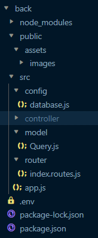

# Création d'un site pour un cinéma de quartier, les cinéma Fun en React et Nodejs

## 1-La base de données:


## 2-La maquette:


## 3-Mise en place du projet node:
1- Création du dossier `projet-pro-react`.   
2- Dans ce dossier, créer un dossier: `back`.   
3- A la racine du projet, créer un fichier .gitignore, pour que gitHub ignore les fichiers et dossiers trop sensibles.

### **- Dans le dossier `back`:**

- Installation dans le terminal du vscode
```bash
npm init -y
npm install nodemon -D
npm i dotenv mysql2 express bcrypt cors jsonwebtoken cookie-parser multer
```
- Dans le fichier `package.json`:   
On va ajouter ceci: 
```json
  "main": "src/app.js",
  "type": "module",
  "scripts": {
    "start": "node src/app.js",
    "dev": "nodemon src/app.js"
  },
```
- Ensuite on créé l'arborescence du dossier `back`: 
  - Avec l'ajout d'un dossier `public` à la racine du dossier `back`
  - Dans le dossier public on aura le dossier `assets` qui contiendra le dossier `ìmages` qui contiendront les images de la BDD.   
  - A la racine du dossier `back` on créé un fichier `.env`, pour les variables d'environnement et un dossier `src`, c'est dans celui-ci qu'on aura au même niveau les dossiers `config` qui contiendra la connexion à la BDD, `controller` qui contiendra les fichiers controller, `model` qui contiendra la classe Query, `router` qui contiendra les routes de l'api.
  - Enfin, on créé à la racine du dossier `src`, le fichier `app.js`.    
  **Visuellement, cela devrait ressemblait à ceci:**   


    


## Partie du dossier CLIENT
A la racine du projet `projet-pro-react`, et dans le terminal, on fait quelques lignes de commande:
```bash 
  npm create vite@latest
```
  on nommera le dossier `client` avec `REACT et javascript + swc`
  on entre dans le répertoire `client`
  et on fait:
  ```bash
  npm install
  npm install react-router-dom react-redux @reduxjs/toolkit sass
  ```

  installation de fontawesome:
  ```bash
   npm i --save @fortawesome/fontawesome-svg-core
   npm i --save @fortawesome/react-fontawesome@latest

   npm i --save @fortawesome/free-solid-svg-icons

   npm i --save @fortawesome/free-brands-svg-icons

  ```
 
 installation du module react slick pour le carousel de la page d'accueil:
 (https://react-slick.neostack.com/docs/get-started#include-css)
 ```bash
 npm install react-slick --save

 npm install slick-carousel --save
 ```


  Les couleurs:
  - Orange : #EBB95C
- Beige: #FFFFCC
- Marron : #3F2413
- Black : #000000
